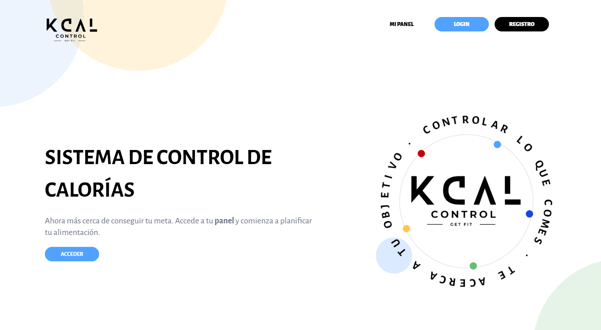
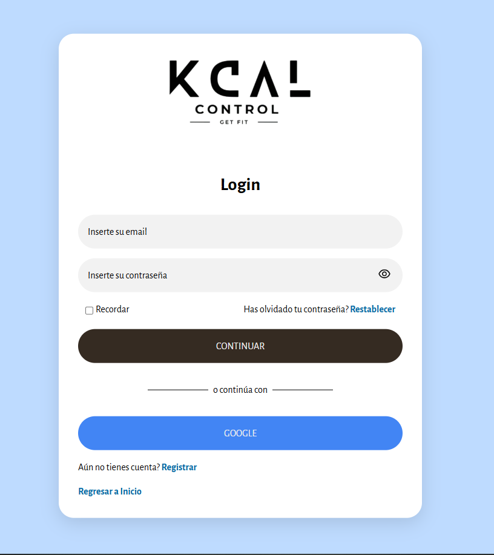

# 🥗 KcalControl

**KcalControl** es una aplicación moderna para llevar el control de calorías de forma sencilla, visual y efectiva. Diseñada para ayudarte a alcanzar tus objetivos nutricionales, mejorar tus hábitos alimenticios y tomar decisiones saludables todos los días.

---

## 📲 En producción

🔗 [Ir a la app](https://tusitio.com)  
📱 Disponible en: iOS / Android  
🛠️ Estado: Activa y en desarrollo continuo

---

## ✨ Características principales

- Registro diario de alimentos y calorías
- Creación de metas personalizadas
- Gráficas de progreso e historial nutricional
- Escaneo de códigos de barra (opcional)
- Soporte multilenguaje
- Interfaz intuitiva y adaptable a cualquier dispositivo

---

## 📸 Capturas de pantalla

<p align="center">
  
  
</p>

---

## 🚀 Instalación (modo desarrollo)

```bash
git clone https://github.com/ydiaval/kcalcontrol.git
cd kcalcontrol
npm install
npm run dev
